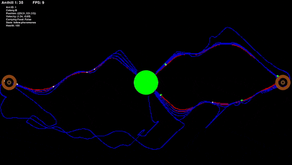

# Ant Colony Simulation

This is a program designed to simulate the behavior of ants of a colony using Python 3 and Pygame.

## Description

The simulation creates multiple anthills and ants that interact with each other and their environment. Anthills are represented as brown circles, while ants are represented as small moving images on the screen. The ants' behavior includes foraging for food, returning to the anthill with food, avoiding collisions with other ants, and following pheromone trails left by other ants.

## Requirements

- Python 3.x
- Pygame library

## Installation

1. Make sure you have Python installed. If not, download and install it from [Python's official website](https://www.python.org/downloads/).
2. Install Pygame by running `pip install pygame` in your terminal or command prompt.

## Usage

1. Run the Python script using a Python interpreter.
2. The simulation window will open, displaying the anthills, food, and ants.
3. Interact with the simulation by observing the behavior of the ants and anthills.
4. You can get feedback on individual ants by clicking on them.
5. Close the window to exit the simulation.

## Code Explanation

- The script defines classes for ants, anthills, food, and a pheromone grid.
- Each ant has attributes such as position, velocity, state, and health. They interact with objects, sense their environment, and react accordingly.
- Anthills have a maximum number of ants they can spawn and store food collected by ants.
- Food objects are placed at the center of the screen, and ants can collect food by approaching them.
- The pheromone grid tracks the pheromone levels left by ants, influencing their movement behavior.
- The main loop of the script controls the simulation, updating the display and handling user input.
  
## Contributing

Pull requests are welcome. For major changes, please open an issue first to discuss what you would like to change.
